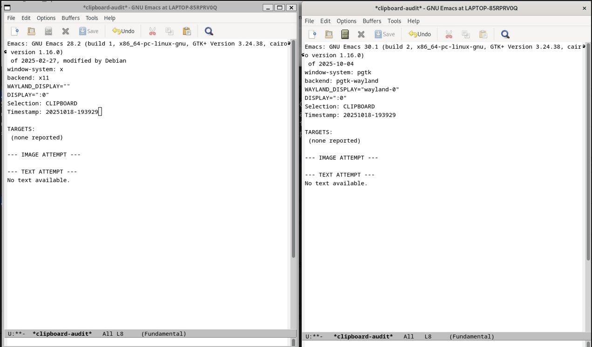
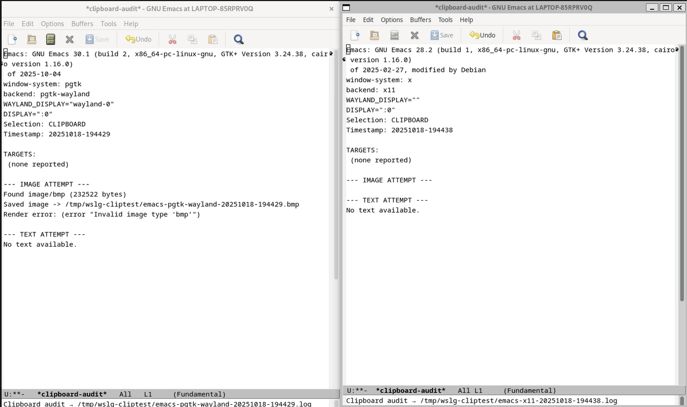
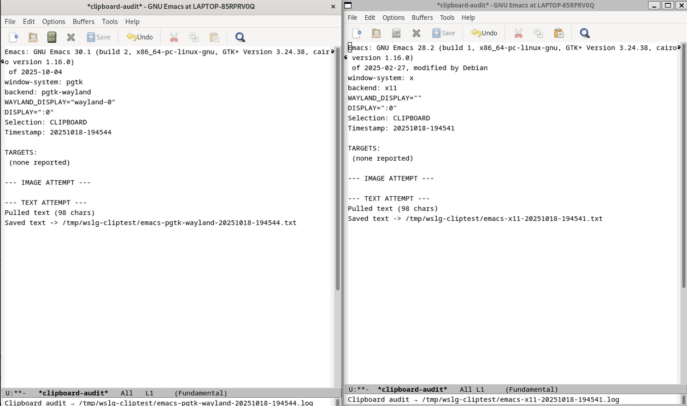
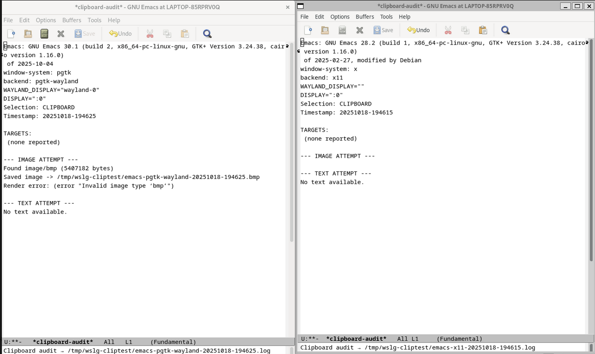

# WSLg Clipboard Audit: Wayland vs X11 (Emacs + CLI)

This report documents a reproducible audit of **Windows ⇄ WSLg** clipboard behavior for **text** and **images**, comparing **Wayland (pgtk)** vs **X11 (Xwayland)** clients. It includes:

- Two shell watchers (`watch-wayland.sh`, `watch-x11.sh`) to observe clipboards without Emacs
- An Emacs-side audit (`wslg-clipboard-audit.el`) that uses only native APIs
- Side‑by‑side screenshots of Emacs results:
  - `clipboard-baseline.png`
  - `clipboard-image1.png`
  - `clipboard-image2.png`
  - `clipboard-text1.png`
  - `clipboard-text2.png`

All files referenced here live alongside this Markdown file for easy viewing in GitHub.

---

## Summary (what we found)

- **Images:** Wayland/pgtk Emacs successfully pulls image bytes from the clipboard (often `image/bmp` when copied from Windows). X11 Emacs does **not** see image targets and retrieves **no image bytes**.  
  → This matches WSLg’s current behavior: **Windows⇄Wayland supports bitmap/image**, **Windows⇄X11 does not**. (see: [WSLg #236 maintainer comment](https://github.com/microsoft/wslg/issues/236) and [discussion in #642](https://github.com/microsoft/wslg/issues/642))

- **Text:** Both Wayland and X11 paths retrieve text reliably (e.g., `UTF8_STRING`, `TEXT`, and on Wayland also `text/html`).

- **Target enumeration quirk on Wayland:** Sometimes `TARGETS` is empty in Emacs/pgtk even though a direct request for `image/bmp` (or `image/png`/`image/jpeg`) **succeeds**. Probing known image types directly works and is recommended as a robustness tweak.

These observations are consistent across multiple runs and independently corroborated by the shell watchers.

---

## Dependencies

Install once inside WSL:
```bash
sudo apt update
sudo apt install -y wl-clipboard xclip coreutils
# optional (for image conversions or inspection):
# sudo apt install -y imagemagick
```

> `coreutils` provides `stat`, `sha1sum`, etc. Most distros already include it.

---

## Shell watchers

### `watch-wayland.sh`
- Polls the **Wayland** clipboard using `wl-paste` (we avoid `--watch` because the wlroots data-control protocol isn’t exposed under WSLg).
- On a change in advertised types, prints them and **pulls** useful ones:
  - `image/png`, `image/jpeg`, `image/bmp`, `image/tiff`
  - `text/html`, `text/plain;charset=utf-8`, `STRING`
- Writes artifacts to `/tmp/wslg-cliptest` (images with sizes; text with lengths).
- `wl-paste` is from the `wl-clipboard` package. — see [wl-clipboard GitHub](https://github.com/bugaevc/wl-clipboard) and the [`wl-paste` man page](https://man.archlinux.org/man/wl-paste.1.en)

Run:
```bash
./watch-wayland.sh
```

### `watch-x11.sh`
- Polls the **X11** clipboard using `xclip` (`-selection clipboard`).
- Always tries to **pull text** (`UTF8_STRING`/`TEXT`) to trigger conversions on demand.
- If **any** `image/*` targets are ever advertised (rare in WSLg), it tries to pull them and records sizes.
- Writes artifacts to `/tmp/wslg-cliptest`.

Run:
```bash
./watch-x11.sh
```

### (Optional) Clear Windows clipboard between trials
```bash
/mnt/c/Windows/System32/WindowsPowerShell/v1.0/powershell.exe \
  -NoProfile -STA -Command \
  "[void][Reflection.Assembly]::LoadWithPartialName('System.Windows.Forms'); [System.Windows.Forms.Clipboard]::Clear()"
```

---

## Emacs audit

File: `wslg-clipboard-audit.el` (included here)

What it does (only Emacs built-ins; **no** external tools):
- Gathers environment and `TARGETS` using `gui-get-selection`.
- **Attempts image fetch even when `TARGETS` is empty** by trying `image/png`, `image/bmp`, `image/jpeg`, `image/tiff` directly.
- Attempts text via `UTF8_STRING` → `TEXT` → `STRING`.
- Saves any payloads under `/tmp/wslg-cliptest` and shows a log buffer.

How to run (two real GUI backends):

**Wayland/pgtk (Emacs 30.1):**
```bash
/usr/local/bin/emacs -Q -l ./wslg-clipboard-audit.el --eval '(ph/clipboard-audit-run)'
```

**X11 (Xwayland, Emacs 28.2):**
```bash
env GDK_BACKEND=x11 WAYLAND_DISPLAY= DISPLAY=:0 \
  /usr/bin/emacs -Q -l ./wslg-clipboard-audit.el --eval '(ph/clipboard-audit-run)'
```

> If Emacs reports a “Render error: Invalid image type 'bmp'”, that only means your Emacs was built without a BMP loader. The **raw bytes were still retrieved and saved**; convert with `convert file.bmp file.png` if needed.

---

## Repro sequence and results

For each step, we ran **both** Emacs builds (Wayland/pgtk and X11) side-by-side.  Not that the --eval isn't actually practical and stuff put on the clipboard before we start pgtk or x11 emacs often doesn't show - so we actually tested by starting each instance side by side after clearing the clipboard using the powershell command.  We would then put an image or text on the clipboard and immediately run `M-x ph/clipboard-audit-run` on both versions of emacs.

1. **Baseline (empty clipboard)**  
   

2. **Copy an image in Windows** (e.g., Snipping Tool → Copy)  
   - **Wayland/pgtk**: `Found image/bmp (…)` and saved file to `/tmp/wslg-cliptest/...bmp`  
   - **X11**: No image targets; no image retrieved  
   

3. **Copy text in Windows**  
   - **Both**: Pulled text successfully (Wayland often sees `text/html` + `text/plain;charset=utf-8`)  
   

4. **Copy another image**  
   - **Wayland/pgtk**: Again retrieves image bytes and saves to file  
   - **X11**: Still no image targets  
   

5. **Copy more text**  
   - **Both**: Pulled text successfully  
   

### Notes from the runs
- If an image is on the Windows clipboard **before** starting Emacs, the first pgtk audit sometimes shows `TARGETS: (none reported)` and no image fetch; **recopying** the image after Emacs is running consistently succeeds. This suggests a **targets/notification quirk** rather than missing data. (Our audit mitigates this by probing common `image/*` types directly.)

- The shell watchers corroborate Emacs:
  - Wayland: `wl-paste` lists `image/bmp` (and saves it).  
  - X11: `xclip` shows only textish targets (`UTF8_STRING`, `TEXT`, `STRING`); it never reported `image/*` in our trials.

---

## Why this matches WSLg design

- WSLg’s architecture bridges clipboard data over RDP and **supports text/HTML/bitmap** for Wayland clients. ([WSLg architecture blog](https://devblogs.microsoft.com/commandline/wslg-architecture/))
- Microsoft maintainers explicitly note: **“copy/paste of image data is only supported between Windows and Wayland native application, but not X11 application.”** (emphasis added). ([WSLg #236](https://github.com/microsoft/wslg/issues/236))
- Another maintainer comment clarifies that **X11↔Windows is text-only (UTF‑8)**, while **Wayland** gets limited HTML and bitmap formats. ([WSLg #642](https://github.com/microsoft/wslg/issues/642))

These statements line up exactly with what we saw: Wayland/pgtk can fetch image bytes; X11 cannot because no image targets are offered to Xwayland apps under WSLg.

---

## What (if anything) Emacs could improve

- **X11 Emacs:** Nothing to do—**image targets are not offered** to X11 apps under WSLg, so Emacs can’t fetch what isn’t there.
- **Wayland/pgtk Emacs:** Consider a small robustness tweak: when `TARGETS` is empty, **probe common image types directly** (`image/png`, `image/bmp`, `image/jpeg`). Our audit showed this succeeds even when enumeration fails, improving UX on WSLg.

---

## Caveats & open questions

- We tested **Windows → WSLg** direction. The reverse direction wasn’t part of this report.
- The occasional empty `TARGETS` on Wayland may indicate a GTK/Wayland/WSLg **enumeration timing** issue; adding a short retry or direct probes works around it.
- The BMP inline render error in Emacs is a **loader absence**, not a transfer failure.

---

## Appendix: How the watchers work

### Wayland watcher (`watch-wayland.sh`)
- Polls `wl-paste --list-types` and normalizes types (sorted/unique).
- On change, prints the list and **pulls** a fixed set of types to files under `/tmp/wslg-cliptest`.
- `wl-clipboard` is the supported tool for Wayland clipboards; it accepts exact MIME types. — see [wl-clipboard GitHub](https://github.com/bugaevc/wl-clipboard)

### X11 watcher (`watch-x11.sh`)
- Polls `xclip -selection clipboard -t TARGETS -o`.
- Proactively **requests text** each tick to ensure conversion happens (some bridges lazily convert on demand).
- If `image/*` ever appears in `TARGETS`, tries to pull it and records size (we never saw this occur under WSLg).

---

## References

- **WSLg architecture:** overall clipboard support (text/HTML/bitmap via RDP). ([WSLg architecture blog](https://devblogs.microsoft.com/commandline/wslg-architecture/))  
- **WSLg GitHub #236:** “image data only supported between Windows and Wayland, not X11.” (Maintainer comment). ([WSLg #236](https://github.com/microsoft/wslg/issues/236))  
- **WSLg GitHub #642 (maintainer):** X11 is *text (UTF‑8) only*; Wayland supports limited HTML & bitmap in addition to text. ([WSLg #642](https://github.com/microsoft/wslg/issues/642))  
- **`wl-clipboard` / `wl-paste` manual:** Wayland clipboard CLI and MIME handling. — see [wl-clipboard GitHub](https://github.com/bugaevc/wl-clipboard) and the [`wl-paste` man page](https://man.archlinux.org/man/wl-paste.1.en)  
- **Superuser thread (X11 clipboard under WSLg):** reports X11 ↔ Windows inconsistencies. (see discussion: https://superuser.com/questions/1723016/clipboard-issues-with-windows-wsl2-gui-apps-wslg)

---

## Repro quick start

```bash
# 0) optional: clear Windows clipboard
/mnt/c/Windows/System32/WindowsPowerShell/v1.0/powershell.exe -NoProfile -STA -Command \
  "[void][Reflection.Assembly]::LoadWithPartialName('System.Windows.Forms'); [System.Windows.Forms.Clipboard]::Clear()"

# 1) start both watchers in two terminals
./watch-wayland.sh
./watch-x11.sh

# 2) run Emacs audits (two terminals)
# Wayland/pgtk
/usr/local/bin/emacs -Q -l ./wslg-clipboard-audit.el --eval '(ph/clipboard-audit-run)'
# X11 (force X11 backend)
env GDK_BACKEND=x11 WAYLAND_DISPLAY= DISPLAY=:0 \
  /usr/bin/emacs -Q -l ./wslg-clipboard-audit.el --eval '(ph/clipboard-audit-run)'
```

**Then copy in Windows:** image → text → image → text.  
You should reproduce the screenshots and artifacts under `/tmp/wslg-cliptest`.
